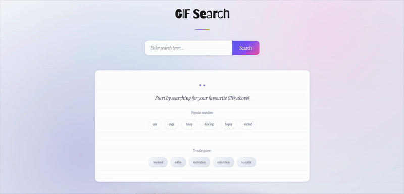

## GIF Search

A web application for searching and displaying GIFs using the [Tenor API](https://tenor.com/gifapi/documentation). Built with Express.js and Handlebars templating engine.



## Live Link
[Check out the live site here](https://acs-3210-tenor-search.onrender.com/)

## Features

- Search for GIFs using keywords
- Fast search results powered by [Tenor API](https://tenor.com/gifapi/documentation)
- Real-time GIF embedding

## Technologies Used

- **Backend**: Node.js, Express.js
- **Templating**: Handlebars (express-handlebars)
- **API**: [Tenor GIF API](https://tenor.com/gifapi/documentation)
- **Frontend**: HTML5, CSS3, JavaScript
- **Fonts**: Google Fonts (Instrument Serif, Barriecito)

## Installation

1. Clone the repository:
```bash
git clone <repository-url>
cd gif-search
```

2. Install dependencies:
```bash
npm install
```

3. Start the development server:
```bash
npm run dev
```
Or start the production server:
```bash
npm start
```

4. Open your browser and navigate to:
```
http://localhost:3000
```

## Usage

1. **Search for GIFs**: Enter any search term in the search box and click "Search"
2. **Browse Results**: View up to 12 GIFs in a grid layout
3. **Try Suggestions**: Click on the suggested tags for popular search terms
4. **View GIFs**: Click on any GIF to view it on Tenor's website

## Project Structure

```
gif-search/
├── app.js                 # Main server file
├── package.json          # Dependencies and scripts
├── public/
│   └── styles.css        # Custom CSS styles
└── views/
    ├── layouts/
    │   └── main.handlebars   # Main HTML layout
    ├── home.handlebars       # Home page template
    ├── greetings.handlebars  # Greeting page template
    └── hello-gif.handlebars  # Hello GIF template
```

## API Integration

This application uses the [Tenor API](https://tenor.com/gifapi/documentation) to fetch GIF search results.

---

Made with ♡ for ACS 3210
